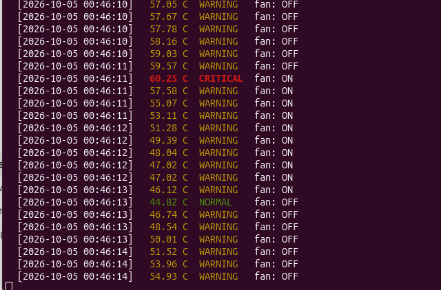
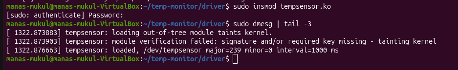
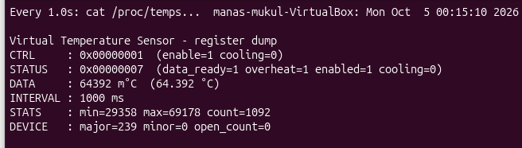
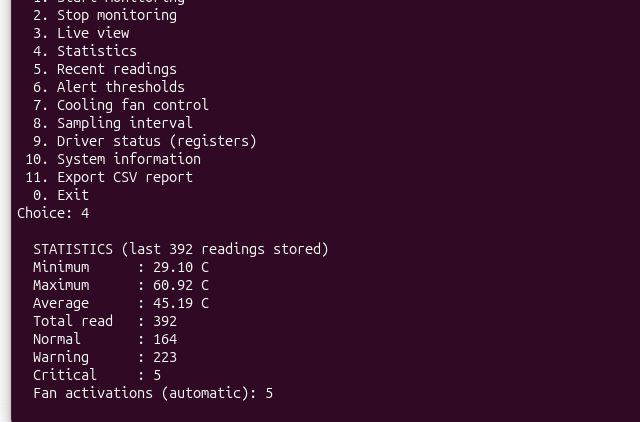
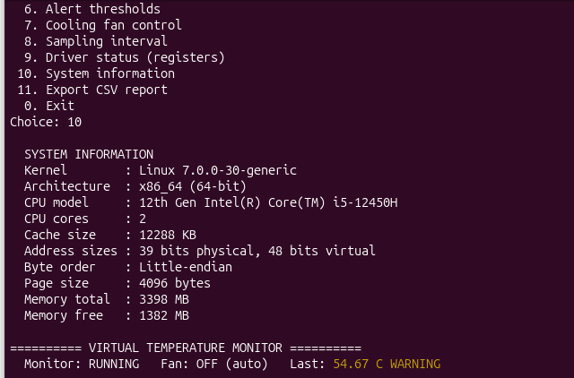
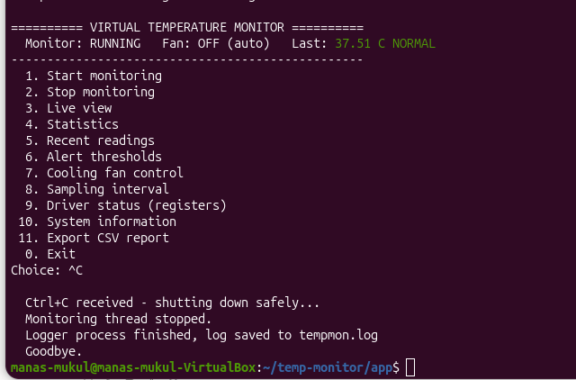
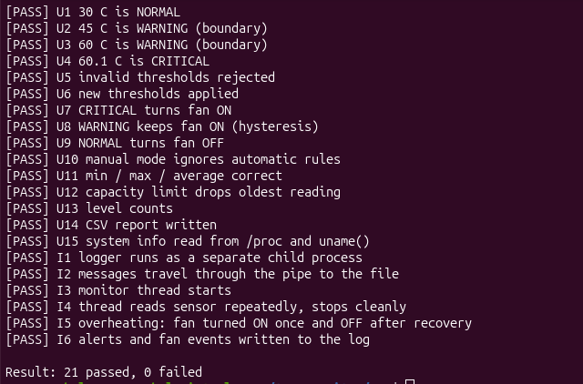

# 🌡️ Virtual Temperature Monitoring & Protection System

A Linux project that **watches a device's temperature and cools it down automatically when it gets too hot**.

It has two parts:

- a **Linux device driver** (written in C) that acts like a temperature sensor and a cooling fan, and
- a **C++ application** that monitors the temperature and switches the fan on and off by itself.

**Author:** Manas Mukul · Wipro Training, Batch 3 · ITER, SOA University
**Built on:** Ubuntu 26.04 · Linux kernel 7.0 · C · C++17

---

## 📌 The Problem

Electronic devices like servers, machines and car engines get hot. If nobody notices in time, **overheating damages the hardware and makes systems shut down suddenly**.

A person cannot watch a thermometer all day. So we need a system that does it automatically.

## 💡 The Solution

This project repeats four steps every second:

| Step | What happens |
|------|--------------|
| 1. **Sense** | Read the temperature from the sensor |
| 2. **Decide** | Is it **Normal** (below 45 °C), **Warning** (45–60 °C) or **Critical** (above 60 °C)? |
| 3. **Act** | If it is **Critical**, switch the **fan ON**. When it is **Normal** again, switch it **OFF** |
| 4. **Record** | Save every reading and event in a log file as proof |

> The sensor and fan are **simulated in software** inside the driver, because no physical hardware was used. This was approved by the trainer. The design works exactly like real hardware, so a real sensor could be connected later by changing **one function** in the driver.

## 📊 Results

| | |
|---|---|
| Highest temperature **without** protection | **69.07 °C** 🔥 |
| Highest temperature **with** automatic cooling | **60.92 °C** ✅ |
| Time to cool from Critical back to Normal | about **2 seconds** |
| Tests passed | **56 out of 56** |

Real example from the log file:

```
00:44:25  ALERT WARNING -> CRITICAL at 60.43 C
00:44:25  FAN ON (automatic) - critical temperature
00:44:27  ALERT WARNING -> NORMAL at 44.98 C
00:44:27  FAN OFF (automatic) - temperature back to normal, recovered in 2.0 s
```

**Automatic cooling in action** (red = critical, fan switches on, then off when normal):



## 🏗️ How It Works

```
   ┌──────────────────────────────────────────┐
   │        C++ APPLICATION  (tempmon)         │   ← normal program (user space)
   │  reads temperature · decides · controls   │
   │  fan · logs events · shows a menu         │
   └────────────────────┬─────────────────────┘
                        │  system calls
                        │  (open, read, ioctl, close)
   ┌────────────────────▼─────────────────────┐
   │      /dev/tempsensor  (device file)       │   ← the "door" to the driver
   └────────────────────┬─────────────────────┘
                        │
   ┌────────────────────▼─────────────────────┐
   │   DRIVER  (tempsensor.ko, inside Linux)   │   ← kernel space
   │  simulated sensor + cooling fan           │
   │  registers: CTRL · STATUS · DATA · INTERVAL│
   └──────────────────────────────────────────┘
```

**Why a driver?** Normal programs are **not allowed to control hardware directly**. They must ask the Linux kernel using **system calls**, and the kernel passes the request to the **driver**, which controls the device. This is how every real device works, from keyboards to Wi-Fi cards.

### The two parts

**1. The driver (`driver/`)** – runs inside the Linux kernel
- When loaded, it creates the device file **`/dev/tempsensor`** and a debug file **`/proc/tempsensor`**
- A timer creates a new temperature reading every second
- The fan is one switch (a bit) in the CTRL register; when it is on, the temperature goes down
- The app can read the temperature (`read`) and send commands like "fan on" (`ioctl`)

**2. The C++ application (`app/`)** – a normal program with a menu
- A **background thread** keeps monitoring, so the menu always stays usable
- Turns the fan **on at Critical** and **off at Normal** automatically
- A **separate logger process** writes everything to `tempmon.log`
- **Ctrl+C** shuts everything down safely, without losing data
- Shows statistics, system information (CPU, memory) and exports a CSV report

Detailed design with diagrams: [`docs/03_Design.md`](docs/03_Design.md)

## 📁 Project Structure

```
Temp-monitor/
├── driver/                 Linux driver (C)
│   ├── tempsensor.c          the driver
│   ├── tempsensor_ioctl.h    commands shared by driver and app
│   └── Makefile              builds the driver
├── app/                    C++ application
│   ├── main.cpp              menu and Ctrl+C handling
│   ├── MonitorEngine         background thread: sense → decide → act → record
│   ├── SensorDevice          talks to /dev/tempsensor
│   ├── AlertManager          Normal / Warning / Critical
│   ├── CoolingController     switches the fan
│   ├── TemperatureHistory    stores readings, min / max / average
│   ├── LoggerProcess         separate process that writes the log
│   ├── SystemInfo            CPU and memory information
│   ├── ReportExporter        saves a CSV report
│   └── Makefile              builds the app
├── tests/                  automatic tests
│   ├── driver_test.cpp       11 driver tests
│   └── app_test.cpp          21 application tests
├── docs/                   documents for all 6 stages + screenshots
├── PROGRESS.md             daily progress log
└── README.md               this file
```

## ⚙️ Requirements

- **Ubuntu Linux** (tested on Ubuntu 26.04, kernel 7.0)
- **Secure Boot turned off** (needed to load a self-built driver)
- Install the tools once:

```bash
sudo apt update
sudo apt install -y build-essential linux-headers-$(uname -r) git
```

## 🚀 How to Run

### Step 1 – Download the project

```bash
git clone https://github.com/ManasMukul03/Temp-monitor.git
cd Temp-monitor
```

### Step 2 – Build and load the driver

```bash
cd driver
make                          # builds tempsensor.ko
sudo insmod tempsensor.ko     # loads the driver into Linux
```

Check that it worked:

```bash
sudo dmesg | tail -3          # should say: "tempsensor: loaded"
ls -l /dev/tempsensor         # the device file now exists
cat /dev/tempsensor           # shows the temperature, e.g. 36250 = 36.25 °C
cat /proc/tempsensor          # shows all the driver's registers
```

### Step 3 – Build and run the application

```bash
cd ../app
make
./tempmon
```

You will see this menu:

```
 1. Start monitoring          7. Cooling fan control
 2. Stop monitoring           8. Sampling interval
 3. Live view                 9. Driver status (registers)
 4. Statistics               10. System information
 5. Recent readings          11. Export CSV report
 6. Alert thresholds          0. Exit
```

**Quick demo:**
1. Press **8** and enter **200** (faster readings, so it heats up sooner)
2. Press **3** for the live view and wait for a red **CRITICAL** line – the fan turns **ON** by itself, and turns **OFF** once the temperature is normal again
3. Press **Enter** to go back, then **4** for statistics
4. Press **Ctrl+C** to exit safely, then run `cat tempmon.log` to see the saved events

### Step 4 – Run the tests

```bash
make test                     # 21 app tests (works without the driver)
cd ../tests
g++ -std=c++17 -Wall -I../driver driver_test.cpp -o driver_test
./driver_test                 # 11 driver tests (driver must be loaded)
```

### Step 5 – Unload the driver when finished

```bash
sudo rmmod tempsensor
```

> After restarting the computer, load the driver again with `sudo insmod tempsensor.ko`.

## 🖼️ Screenshots

| Driver loaded | Driver registers (overheating) |
|---|---|
|  |  |

| Statistics | System information |
|---|---|
|  |  |

| Safe shutdown with Ctrl+C | All tests passing |
|---|---|
|  |  |

All screenshots: [`docs/screenshots/`](docs/screenshots)

## 🧪 Testing

| Type | What it checks | Passed |
|------|----------------|--------|
| Driver – manual | building, loading, device file, overheat flag, unloading | 13 / 13 |
| Driver – automatic | every command, wrong inputs rejected, fan cools the device | 11 / 11 |
| Unit tests | each class on its own (alerts, fan rules, statistics…) | 15 / 15 |
| Integration tests | parts working together (thread + logger + fan) | 6 / 6 |
| System tests | the full app running with the real driver | 11 / 11 |
| **Total** | | **56 / 56** |

Details: [`docs/05_Testing.md`](docs/05_Testing.md)

## 🧠 Concepts Used

| Topic | Where it is used |
|-------|------------------|
| **Linux** | Ubuntu, terminal commands, `/dev`, `/proc`, loading drivers with `insmod` |
| **Device drivers** | character device, `read` and `ioctl` handlers, kernel timer, lock |
| **System programming** | system calls, threads, mutex, signals (Ctrl+C), `fork` + `pipe` |
| **C++** | classes, interface, inheritance, STL containers, file handling |
| **Computer architecture** | device registers, user mode vs kernel mode, CPU / cache / memory info |

## 📚 Project Documents (6 Stages)

| Stage | Document |
|-------|----------|
| 1. Project Introduction | [`docs/01_Introduction.md`](docs/01_Introduction.md) |
| 2. Requirements & Plan | [`docs/02_PRD.md`](docs/02_PRD.md) |
| 3. Design & Architecture (UML diagrams) | [`docs/03_Design.md`](docs/03_Design.md) |
| 4. Implementation & Prototype | [`docs/04_Prototype_Log.md`](docs/04_Prototype_Log.md) |
| 5. Testing & Improvement | [`docs/05_Testing.md`](docs/05_Testing.md) |
| 6. Final Summary | [`docs/06_Final_Summary.md`](docs/06_Final_Summary.md) |

Daily progress: [`PROGRESS.md`](PROGRESS.md)

## 🌿 Git Workflow

- **`main`** – final, working version (tagged `stage-1` to `stage-6`)
- **`develop`** – where finished features are combined
- **`feature/driver`**, **`feature/app`** – one branch for each part while it was being built

## ⚠️ Limitations

- The sensor and fan are simulated, not physical
- The app checks the temperature at fixed intervals
- One sensor only, and a text-based (console) interface

## 🔭 Future Improvements

- Connect a **real temperature sensor** (for example on a Raspberry Pi) by changing one driver function
- Control a **real fan** through a hardware pin
- Support **several sensors** at the same time
- Show the temperature on a **web dashboard**
