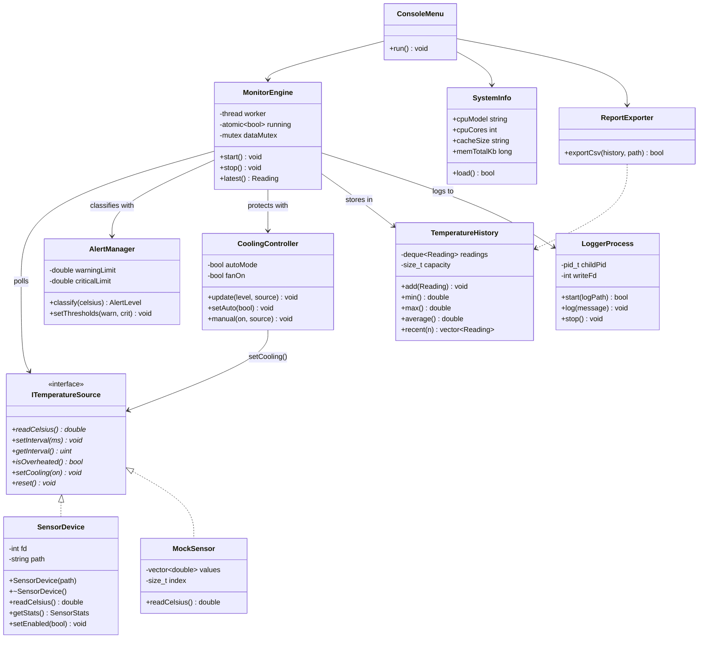
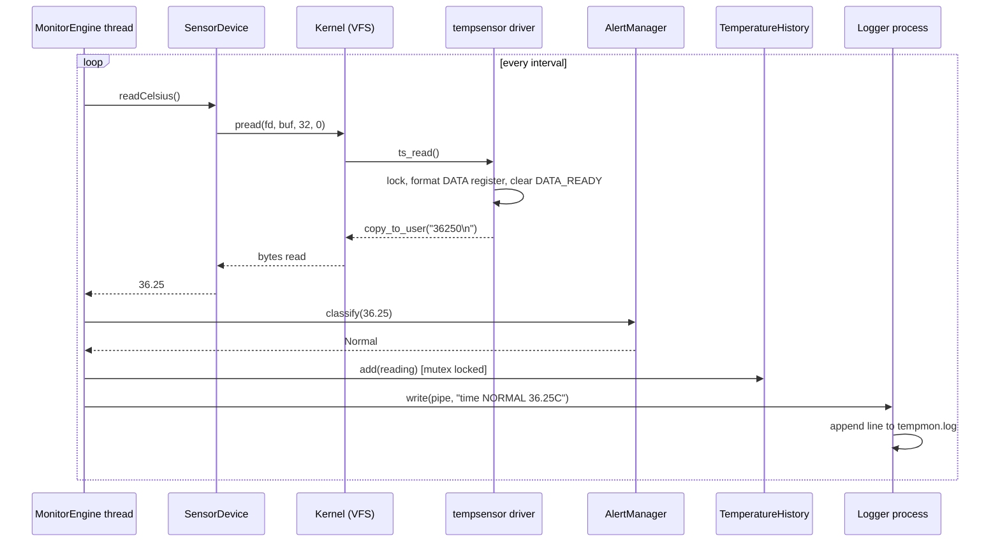
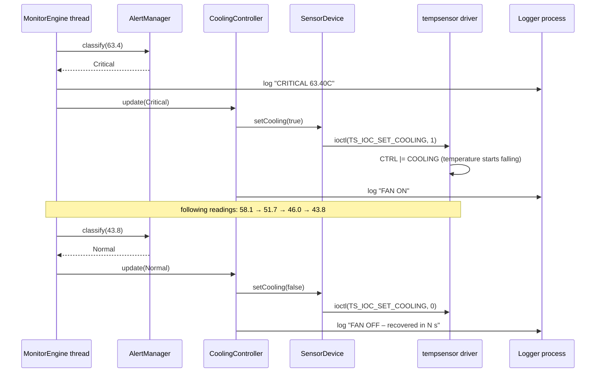
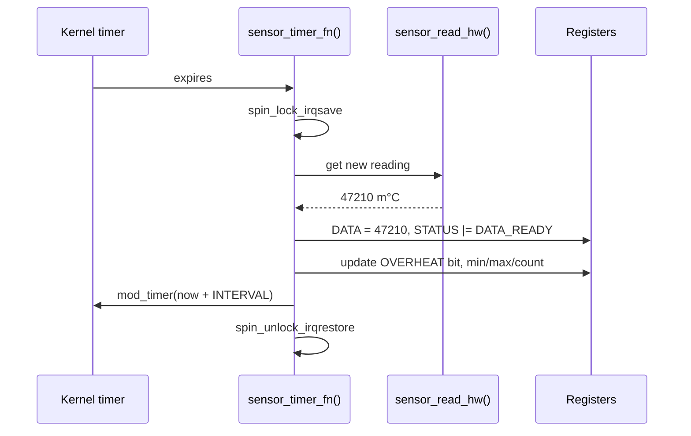
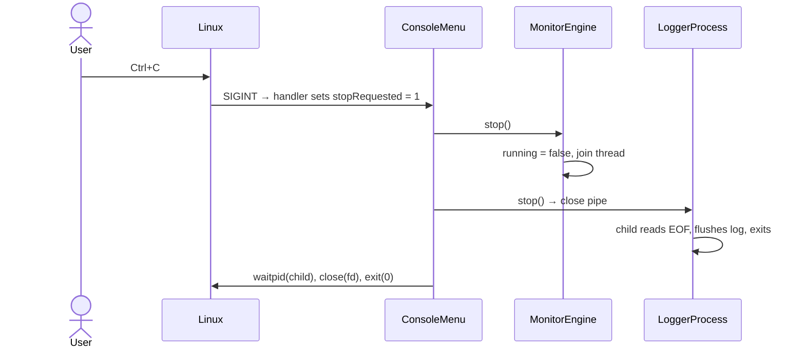
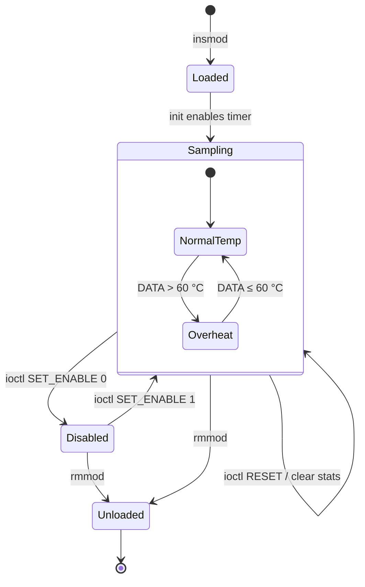
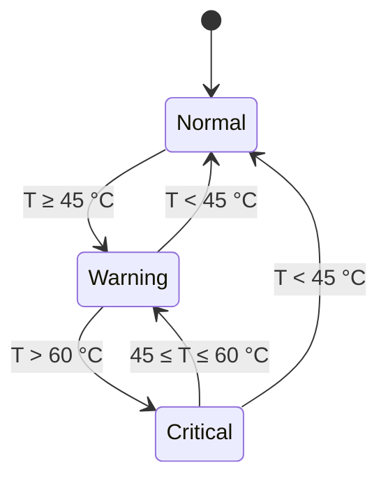
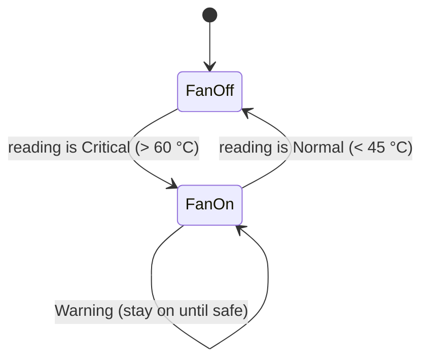
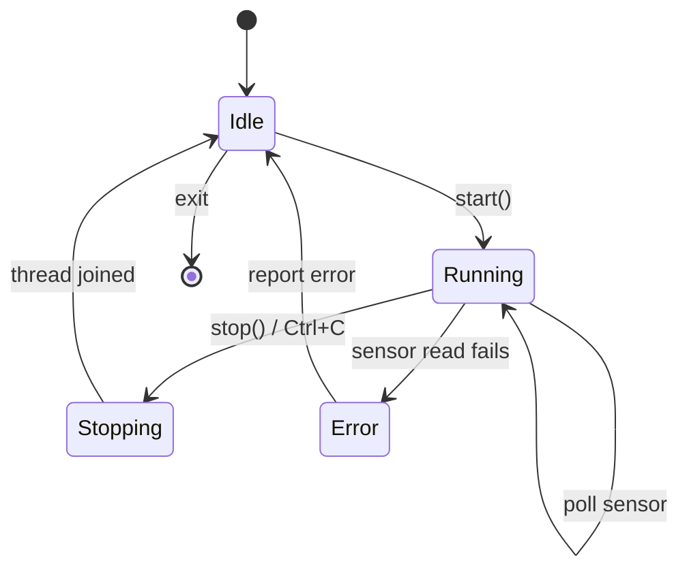

# Stage 3 – System Design & Architecture

**Project:** Virtual Temperature Monitoring System
**Author:** Manas Mukul
**Version:** 1.0 – 30 September 2026

> Diagrams are written in Mermaid, which GitHub renders automatically.
> Exported images for the report are stored in `docs/diagrams/`.

---

## 1. Overall Architecture

The system is split across the two privilege levels of the CPU:

- **User space** (restricted mode): the C++ monitoring application and the logger process
- **Kernel space** (privileged mode): the `tempsensor` driver and its simulated registers

User space can reach the driver **only through system calls**. This is the same boundary that protects every real device.

```
┌──────────────────────────── USER SPACE ────────────────────────────┐
│                                                                    │
│   ┌─────────────── tempmon (C++ application) ───────────────┐      │
│   │  Console Menu                                           │      │
│   │     │                                                   │      │
│   │  MonitorEngine ──(thread)──► SensorDevice               │      │
│   │     │   │                        │ open/pread/ioctl     │      │
│   │     │   ├─► AlertManager         │                      │      │
│   │     │   ├─► CoolingController ─────┤ (ioctl SET_COOLING)  │      │
│   │     │   ├─► TemperatureHistory   │                      │      │
│   │     │   └─► LoggerProcess ──pipe──────► Logger (child)──┼──► tempmon.log
│   │  SystemInfo ◄── /proc/cpuinfo, /proc/meminfo            │      │
│   │  ReportExporter ──► readings.csv                        │      │
│   └──────────────────────────────┬──────────────────────────┘      │
└──────────────────────────────────┼─────────────────────────────────┘
                     system calls  │  (switch to kernel mode)
┌──────────────────────────────────┼──── KERNEL SPACE ───────────────┐
│                                  ▼                                 │
│   VFS  ──►  /dev/tempsensor  (character device, major/minor)       │
│                    │                                               │
│           tempsensor driver: file_operations                       │
│           open · read · unlocked_ioctl · release                   │
│                    │                                               │
│   Simulated registers: CTRL · STATUS · DATA · INTERVAL             │
│   Simulated cooling fan: CTRL.COOLING pulls temperature down       │
│                    ▲                                               │
│           kernel timer ──► sensor_read_hw()  (simulated sensor)    │
│                                                                    │
│   /proc/tempsensor  (register dump for debugging)                  │
└────────────────────────────────────────────────────────────────────┘
```

## 2. Components and Responsibilities

| Component | Layer | Responsibility |
|-----------|-------|----------------|
| `tempsensor` driver | Kernel | Registers the character device, keeps registers, handles `read`/`ioctl` |
| Kernel timer | Kernel | Produces a new reading every `INTERVAL` ms |
| `sensor_read_hw()` | Kernel | The only hardware-dependent function; simulates the sensor |
| `/proc/tempsensor` | Kernel | Shows all registers in readable text |
| `ITemperatureSource` | User | Abstract interface for anything that gives temperatures |
| `SensorDevice` | User | Implements the interface using system calls on `/dev/tempsensor` |
| `MockSensor` | User (tests) | Implements the interface with fixed values for unit tests |
| `MonitorEngine` | User | Background thread: poll → classify → store → log |
| `AlertManager` | User | Decides Normal / Warning / Critical |
| `CoolingController` | User | Automatic protection: fan on at Critical, off at Normal |
| `TemperatureHistory` | User | Keeps recent readings; computes min, max, average |
| `LoggerProcess` | User | Forks a child process; sends log lines through a pipe |
| `SystemInfo` | User | Reads CPU and memory information from `/proc` |
| `ReportExporter` | User | Writes readings to CSV |
| `ConsoleMenu` | User | User interaction; installs the Ctrl+C (SIGINT) handler |

## 3. Interfaces

### 3.1 Driver ↔ Application (`driver/tempsensor_ioctl.h`)

| Call | Direction | Data |
|------|-----------|------|
| `open("/dev/tempsensor")` | – | returns file descriptor |
| `pread(fd, buf, n, 0)` | kernel → user | text, e.g. `"36250\n"` (milli-°C) |
| `ioctl(TS_IOC_SET_INTERVAL, &u32)` | user → kernel | 100 – 10000 ms, else `EINVAL` |
| `ioctl(TS_IOC_GET_INTERVAL, &u32)` | kernel → user | current interval |
| `ioctl(TS_IOC_GET_STATUS, &u32)` | kernel → user | STATUS register |
| `ioctl(TS_IOC_GET_STATS, &stats)` | kernel → user | `struct tempsensor_stats` |
| `ioctl(TS_IOC_RESET)` | – | clears statistics |
| `ioctl(TS_IOC_SET_ENABLE, &u32)` | user → kernel | 1 = sampling on, 0 = off |
| `ioctl(TS_IOC_SET_COOLING, &u32)` | user → kernel | 1 = cooling fan on, 0 = off |
| unknown command | – | `ENOTTY` |

### 3.2 Application ↔ Logger process

One-way **pipe**: the parent writes text lines (`"2026-10-01 10:15:02 WARNING 47.20C\n"`); the child reads them and appends to `tempmon.log`. When the parent closes its end of the pipe, the child reads end-of-file and exits.

## 4. Data Structures

### 4.1 Driver (C)

```c
struct tempsensor_dev {
    u32 reg_ctrl;        /* CTRL register:   bit0 ENABLE, bit1 COOLING            */
    u32 reg_status;      /* STATUS register: bit0 DATA_READY, bit1 OVERHEAT,
                                             bit2 ENABLED, bit3 COOLING          */
    s32 reg_data;        /* DATA register:   temperature in milli-°C             */
    u32 reg_interval;    /* INTERVAL register: ms                                */
    struct tempsensor_stats stats;   /* min_mc, max_mc, count                   */
    struct timer_list timer;         /* periodic sampling                       */
    spinlock_t lock;                 /* protects registers (timer vs syscalls)  */
    dev_t devno; struct cdev cdev;   /* major/minor + char device               */
    struct class *class; struct device *device;
};
```

**Register map**

| Register | Bits | Meaning |
|----------|------|---------|
| CTRL | 0 | ENABLE – sensor sampling on/off |
| CTRL | 1 | COOLING – cooling fan on/off |
| STATUS | 0 | DATA_READY – new value not yet read (cleared by `read`) |
| STATUS | 1 | OVERHEAT – DATA > 60 000 m°C |
| STATUS | 2 | ENABLED – mirrors CTRL.ENABLE |
| STATUS | 3 | COOLING – mirrors CTRL.COOLING |
| DATA | 31..0 | signed temperature, milli-°C |
| INTERVAL | 31..0 | sampling period, ms |

Milli-degrees are used because floating point is not used inside the Linux kernel.

### 4.2 Application (C++)

| Structure | Type | Purpose |
|-----------|------|---------|
| `Reading` | `struct { time_point time; double celsius; AlertLevel level; }` | One sample |
| `AlertLevel` | `enum class { Normal, Warning, Critical }` | Classification |
| History buffer | `std::deque<Reading>` (max 1000) | Fixed-size history, O(1) add/remove at ends |
| Alert counts | `std::map<AlertLevel, int>` | Counters for the summary |
| Shared-data lock | `std::mutex` | Protects history between monitor thread and menu |
| Run flag | `std::atomic<bool>` | Tells the monitor thread to stop |
| Signal flag | `volatile sig_atomic_t` | Set by the SIGINT handler |

## 5. UML – Class Diagram



`ITemperatureSource` lets the monitor work with the real driver or with `MockSensor` in unit tests (polymorphism). A future real-hardware class can be added without changing `MonitorEngine`.

## 6. UML – Sequence Diagrams

### 6.1 One monitoring cycle (user space → kernel → user space)



### 6.2 Automatic overheating protection (real-world response)



### 6.3 Driver sampling (inside the kernel)



### 6.4 Clean shutdown with Ctrl+C



## 7. UML – State Machine Diagrams

### 7.1 Sensor driver



### 7.2 Alert level (application)



### 7.3 Cooling fan (automatic mode)



The fan turns on at 60 °C but only turns off below 45 °C. This gap (hysteresis) stops the fan from switching on and off repeatedly around a single limit, the same technique used in real thermostats.

### 7.4 Monitor engine



## 8. Implementation Plan

| Order | Work | Output |
|-------|------|--------|
| 1 | Driver: char device, registers, timer, read, ioctl, /proc | `driver/tempsensor.c` |
| 2 | Driver test program | `tests/driver_test.cpp` |
| 3 | `ITemperatureSource`, `SensorDevice`, `MockSensor` | `app/` |
| 4 | `AlertManager`, `TemperatureHistory`, `CoolingController` + unit tests | `app/`, `tests/` |
| 5 | `MonitorEngine` thread with mutex | `app/` |
| 6 | `LoggerProcess` with fork + pipe, SIGINT handling | `app/` |
| 7 | `SystemInfo`, `ReportExporter`, `ConsoleMenu` | `app/` |
| 8 | Integration and system testing | `docs/05_Testing.md` |

Core first (steps 1–3), so a working driver → application path exists as early as possible.

## 9. Development Environment

| Item | Choice |
|------|--------|
| Host | Windows laptop with Oracle VirtualBox 7.2 |
| Guest OS | Ubuntu 26.04 LTS (64-bit), Linux kernel 7.0 |
| VM resources | 4 GB RAM, 2 CPUs, 30 GB disk, UEFI/Secure Boot disabled so unsigned modules can load |
| Toolchain | gcc, g++ (C++17), make, Linux kernel headers for the running kernel |
| Kernel tools | `insmod`, `rmmod`, `lsmod`, `modinfo`, `dmesg` |
| Editors | nano, GNOME Text Editor |
| Version control | Git + GitHub |
| Safety | VirtualBox snapshot taken before loading the driver |

### 9.1 Environment setup (from scratch)

1. **Create the virtual machine** in VirtualBox: Ubuntu 64-bit, 4 GB RAM, 2 CPUs, 30 GB disk. In *Settings → System → Motherboard* (Expert mode) untick **UEFI** so Secure Boot does not block self-built kernel modules. Set video memory to 128 MB.
2. **Install Ubuntu 26.04 LTS** in the VM (interactive installation, default applications, erase the virtual disk, no disk encryption).
3. **Install the build tools and kernel headers:**
   ```bash
   sudo apt update
   sudo apt install -y build-essential linux-headers-$(uname -r) git
   ```
   `build-essential` provides gcc, g++ and make; `linux-headers-$(uname -r)` provides the headers of the exact running kernel, which are required to compile a module for it.
4. **Take a VirtualBox snapshot** (`clean-setup`) so the VM can be restored instantly if a driver bug freezes the kernel.

### 9.2 Project creation

```bash
mkdir -p ~/temp-monitor/{driver,app,tests,docs/diagrams}
cd ~/temp-monitor
git init -b main
```

Files are created with `nano <file>` or `gnome-text-editor <file>`, in dependency order:

| Order | File | Purpose |
|-------|------|---------|
| 1 | `driver/tempsensor_ioctl.h` | Shared interface: register bits, ioctl commands, stats structure |
| 2 | `driver/tempsensor.c` | Kernel driver |
| 3 | `driver/Makefile` | Kbuild rules to compile the module against the running kernel |
| 4 | `tests/driver_test.cpp` | User-space tests for every driver operation |
| 5 | `app/*` | C++ monitoring application (Stage 4) |
| 6 | `docs/*`, `README.md`, `PROGRESS.md`, `.gitignore` | Documentation and tracking |

### 9.3 Build – load – verify – unload cycle

```bash
cd ~/temp-monitor/driver
make                          # compile tempsensor.c -> tempsensor.ko
sudo insmod tempsensor.ko     # load the module into the running kernel
sudo dmesg | tail -3          # driver log: "loaded, /dev/tempsensor major=... minor=0"
ls -l /dev/tempsensor         # crw-rw-rw- : character device node
cat /dev/tempsensor           # latest reading in milli-°C
cat /proc/tempsensor          # register dump
cd ../tests
g++ -std=c++17 -Wall -I../driver driver_test.cpp -o driver_test
./driver_test                 # automated driver tests
sudo rmmod tempsensor         # unload; /dev/tempsensor disappears
```

After changing the driver source: `sudo rmmod tempsensor` → `make` → `sudo insmod tempsensor.ko`.
After restarting the VM the module must be loaded again with `insmod`.

## 10. Git Repository & Branching Strategy

```
main ─────●────────────●────────────●──────────●   (stable, one tag per stage)
           \          /  \          /
develop     ●───●───●     ●───●───●               (integration)
             \     /       \     /
feature/driver ●─●     feature/app ●─●            (one branch per module)
```

| Branch | Purpose |
|--------|---------|
| `main` | Only working, reviewed code; tagged at the end of each stage (`stage-1` … `stage-6`) |
| `develop` | Integration of finished features |
| `feature/<name>` | One module at a time: `feature/driver`, `feature/app-core`, `feature/logger`, … |

**Workflow:** create a feature branch from `develop` → commit small steps → merge into `develop` when it builds and tests pass → merge `develop` into `main` and tag at the end of a stage.

**Commit message format:** `<area>: <what changed>` – e.g. `driver: add ioctl GET_STATS`, `docs: stage 3 UML diagrams`.

## 11. Progress Tracking

- `PROGRESS.md` – daily log: work done, issues and solutions, next steps
- `README.md` – stage checklist
- Git tags – one per completed stage
- `docs/04_Prototype_Log.md` – issues found during implementation

---

## 12. Stage 3 Summary

### 12.1 Deliverables

| Deliverable | Location |
|-------------|----------|
| System architecture and diagram | Section 1 |
| Components, interfaces, data structures, register map | Sections 2–4 |
| UML: 1 class diagram, 4 sequence diagrams, 4 state machine diagrams | Sections 5–7 |
| Implementation plan | Section 8 |
| Development environment setup and build workflow | Section 9 |
| Git branching strategy | Section 10 |
| Shared driver interface header | `driver/tempsensor_ioctl.h` |
| Driver prototype | `driver/tempsensor.c`, `driver/Makefile` |
| Driver test program (11 tests) | `tests/driver_test.cpp` |

### 12.2 Version control

- Branches created: `main`, `develop`, `feature/driver`
- Commits: `docs: stage 3 architecture and UML diagrams`, `driver: tempsensor char device, timer, read, ioctl, cooling fan, /proc`
- `feature/driver` merged into `develop`, `develop` merged into `main`
- Tag: `stage-3`

### 12.3 Progress evidence

- `PROGRESS.md` entry for 30 Sep 2026, including issues faced and their solutions
- Development environment: Ubuntu 26.04 LTS, kernel 7.0.0-30-generic
- Driver loaded successfully: `/dev/tempsensor` created as a character device (major 239, minor 0)
- Register dump showed the OVERHEAT bit set automatically at 69.07 °C
- Driver tests: **11 passed, 0 failed**

### 12.4 Demonstration

1. Show the architecture diagram and explain the user space / kernel space boundary
2. Show the UML diagrams, especially the overheating-protection sequence (6.2) and the fan state machine (7.3)
3. Live demo of the driver:
   ```bash
   cd driver && make && sudo insmod tempsensor.ko
   sudo dmesg | tail -3
   ls -l /dev/tempsensor
   cat /dev/tempsensor
   cat /proc/tempsensor
   cd ../tests && ./driver_test
   ```
4. Show the Git branches and tags on GitHub

### 12.5 Roadmap to Stage 4

- Implement the C++ application core: `ITemperatureSource`, `SensorDevice`, `AlertManager`, `TemperatureHistory`, `CoolingController`
- Implement `MonitorEngine` with a background thread and mutex
- Integrate the application with the driver and demonstrate live monitoring with automatic cooling
- Record progress, issues and solutions in `docs/04_Prototype_Log.md`
